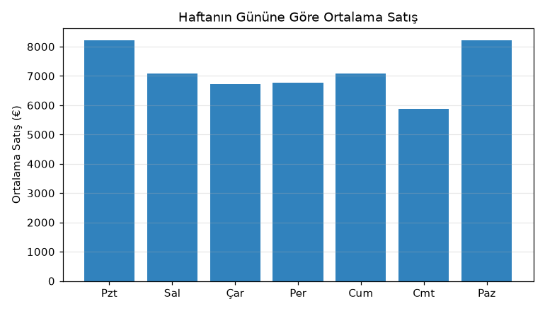
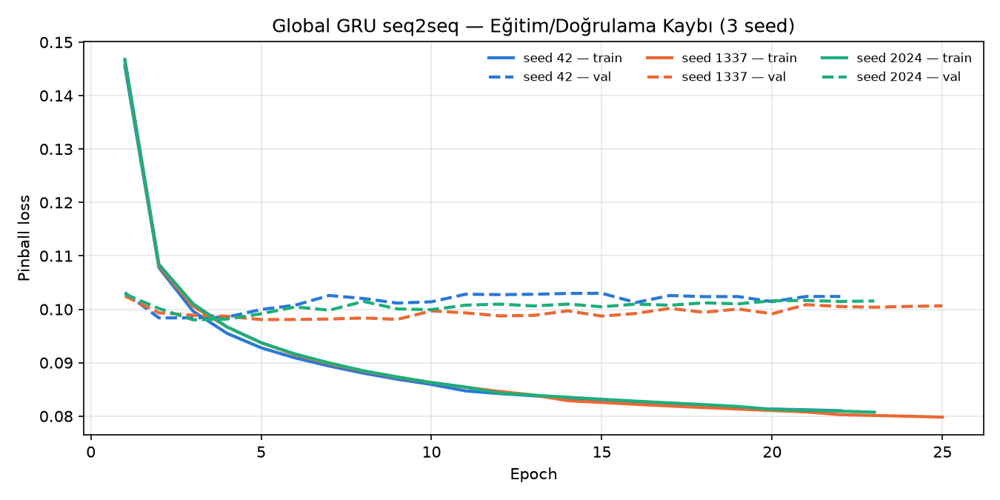
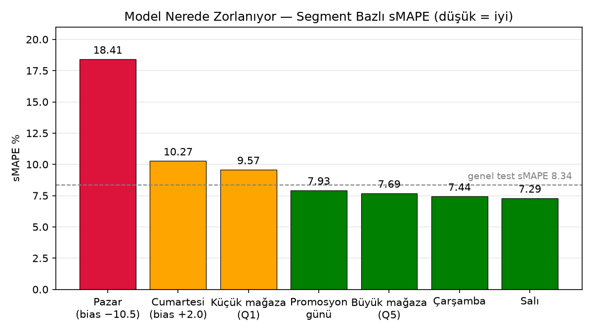
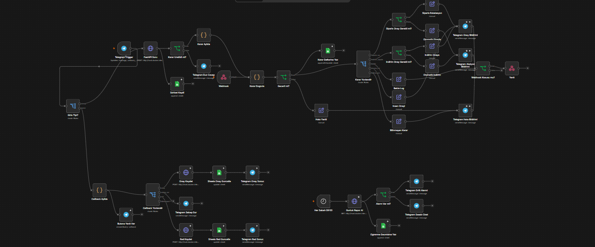
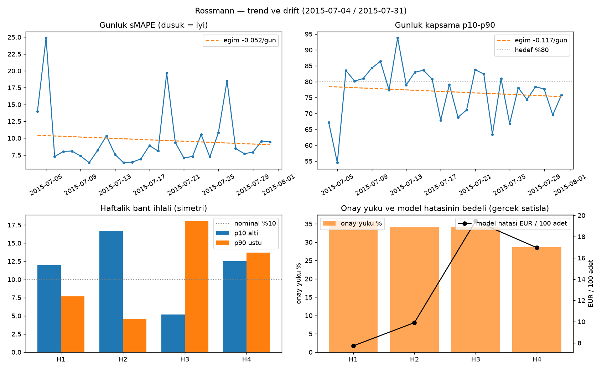

# Rossmann Taze Kategori — Talep Tahmininden İnsan Onaylı Stok Kararına

Bir perakende zincirinde raf ömrü 3 gün olan taze ürün için her mağazaya her
gün ne kadar sipariş verileceği iki yönlü bir risktir: az sipariş satış
kaybettirir, fazla sipariş malı çöpe gönderir. Bu proje, 1115 Rossmann
mağazası için bu kararı uçtan uca ele alır:

1. **Tahmin.** Bir derin öğrenme modeli (GRU) her mağazanın önümüzdeki 28
   günlük talebini tek bir sayı olarak değil, bir aralık olarak tahmin eder:
   iyimser, beklenen ve kötümser senaryo (p10 / p50 / p90).
2. **Karar.** Deterministik bir karar motoru bu tahmini eldeki stok, raf
   ömrü ve tedarikçi sözleşmeleriyle birleştirir ve her mağaza-gün için dört
   karardan birini üretir: *sipariş ver, bekle, indirim uygula, insana sor.*
3. **Arayüz ve otomasyon.** Bir LLM asistanı planlama ekibinin doğal dildeki
   sorularını doğru hesaplama aracına yönlendirir; n8n otomasyonu kararı
   Telegram üzerinden insan onayına, Google Sheets'e kayda ve günlük izleme
   raporuna bağlar.

Kararlar, gerçekleşen satışlarla karşılaştırıldığı bir geriye dönük testle
ölçülmüştür.

| Katman | Ne yapar | Ana sonuç |
|---|---|---|
| **Tahmin modeli** | Global GRU seq2seq, p10/p50/p90, 3 seed | test sMAPE **8.34** (XGBoost 9.07), kalibre kapsama **%77.4** |
| **Karar + LLM asistanı** | 12 araç, deterministik kural motoru, sabit JSON şema, RAG | araç seçimi **59/59**, yasaklı araç ihlali **0**, **51** birim testi |
| **Otomasyon (n8n)** | Doğrulama → yönlendirme → insan onayı → kayıt → günlük drift raporu | 45 node, Telegram + Google Sheets, uçtan uca canlı |
| **Gerçek satışla test** | Siparişler tahminle, tüketim gerçek talepten | Ulaşılabilir değerin **%92.3**'ü; model hatasının bedeli **628.793 EUR** |

### Terimler

| Terim | Anlamı |
|---|---|
| **p10 / p50 / p90** | Tahmin dağılımının kuantilleri. p50 beklenen (medyan) talep; talep %90 ihtimalle p90'ın altında kalır. p10–p90 arası **tahmin bandıdır**. |
| **sMAPE** | Yüzde cinsinden simetrik tahmin hatası. Düşük = iyi. |
| **Kapsama** | Gerçek satışın p10–p90 bandı içinde kalma oranı. İdeal değer %80. |
| **Fire** | Raf ömrü dolduğu için satılamayıp atılan mal. |
| **Newsvendor** | Bozulabilir üründe az ve fazla siparişin maliyetini dengeleyen klasik stok modeli. |
| **Origin** | Tahminin yapıldığı gün ("bugün"). Model yalnız bu güne kadarki veriyi görür. |
| **Backtest** | Kararları geçmiş bir döneme uygulayıp gerçekleşen satışla ölçmek. |

---

## İçindekiler

Bölümler, veri bilimi projelerinde yaygın kullanılan **CRISP-DM** sırasını
izler: iş problemi → veri → hazırlık → modelleme → değerlendirme → kullanım.

| # | Bölüm | CRISP-DM aşaması |
|---|---|---|
| 1 | [Problem tanımı ve kapsam](#1-problem-tanımı-ve-kapsam) | İş anlayışı |
| 2 | [Veri anlayışı](#2-veri-anlayışı) | Veri anlayışı |
| 3 | [Veri hazırlama](#3-veri-hazırlama) | Veri hazırlama |
| 4 | [Sistem mimarisi](#4-sistem-mimarisi) | Modelleme |
| 5 | [Tahmin modeli](#5-tahmin-modeli) | Modelleme |
| 6 | [Tahmin modelinin değerlendirmesi](#6-tahmin-modelinin-değerlendirmesi) | Değerlendirme |
| 7 | [Karar katmanı — stok projeksiyonu ve kural motoru](#7-karar-katmanı--stok-projeksiyonu-ve-kural-motoru) | Modelleme |
| 8 | [LLM asistanı](#8-llm-asistanı) | Kullanıma alma |
| 9 | [n8n otomasyonu](#9-n8n-otomasyonu) | Kullanıma alma |
| 10 | [Gerçek satışla geriye dönük test](#10-gerçek-satışla-geriye-dönük-test) | Değerlendirme |
| 11 | [Bulunan hatalar ve düzeltmeler](#11-bulunan-hatalar-ve-düzeltmeler) | Değerlendirme |
| 12 | [Drift izleme ve öğrenme döngüsü](#12-drift-izleme-ve-öğrenme-döngüsü) | Kullanıma alma |
| 13 | [Testler](#13-testler) | — |
| 14 | [Kurulum ve çalıştırma](#14-kurulum-ve-çalıştırma) | — |
| 15 | [Repo yapısı](#15-repo-yapısı) | — |

---

## 1. Problem tanımı ve kapsam

Taze kategoride her mağaza-gün için üç soru cevaplanmalıdır:

| Soru | Yanlış cevabın bedeli |
|---|---|
| Sipariş verilsin mi, ne kadar? | Az → kaçan kâr. Çok → fire |
| Elde eriyemeyecek stok var mı? | İndirim geciktikçe mal değersizleşir |
| Bu karar otomatik uygulanabilir mi? | Yanlış otomatik karar, denetimsiz zarar |

Üçüncü soru projenin merkezindedir. Bir tahmin modeli sayı üretir; bir
**karar sistemi** ise o sayının hangi mağazada, hangi gün güvenilir olduğunu
da bilmek zorundadır. Bu yüzden sistem her kararla birlikte "bu kararı insan
görmeli mi" sorusunu da cevaplar.

**Maliyet asimetrisi.** Birim fiyat 8 EUR, marj %25 varsayılmıştır. Satılamayan
bir birimin maliyeti (Co) 6 EUR, kaçan bir satışın maliyeti (Cu) 2 EUR'dur.
Fire, kaçan satıştan **üç kat pahalıdır**; sipariş politikasının "bilerek biraz
az sipariş vermesinin" sebebi budur (bölüm 7).

**Başarı nasıl ölçülür.** Üç ayrı düzeyde:

| Düzey | Ölçüt |
|---|---|
| Tahmin | sMAPE (baseline'lara karşı), tahmin bandının kapsaması |
| İş | Gerçek satışla backtest'te toplam kayıp (kaçan kâr + fire) ve ulaşılabilir değerin yakalanan kısmı |
| Operasyon | Onay yükü (insana giden karar oranı), asistanın doğru aracı seçme oranı |

### Kapsam — neye bakıldı, neye bakılmadı

**Bakılanlar.** 1115 mağaza, günlük düzey, 28 günlük ufuk, tek bir taze ürün
kategorisi. Mağazalar arası farklılıklar (mağaza tipi, ürün yelpazesi,
büyüklük, promosyon, resmi ve okul tatili, kapalı günler) hem modele girdi
olarak verildi hem de değerlendirmede **ayrı ayrı** ölçüldü (bölüm 6, hata
analizi).

**Bakılmayanlar — ve neden:**

| Konu | Neden kapsam dışı |
|---|---|
| Ürün bazlı talep | Veride ürün kırılımı yok; taze kategori ciro üzerinden türetildi (bölüm 3) |
| Birden çok ülke | Veri tek ülkeye (Almanya) ait; ülkeler arası tatil, fiyat ve tüketici farkları modellenmedi |
| Olağanüstü şoklar (savaş, doğal afet, salgın, yerel olaylar) | Eğitim döneminde (2013–2015) yok; model bu tür kırılmaları öngöremez. Bu durumda sistemin yapabileceği, bozulmayı izleme katmanıyla fark edip kararı insana devretmektir (bölüm 12) |
| Hava durumu, etkinlik, rakip kampanyası gibi dış veriler | Veri setinde yok |
| Fiyat esnekliği | Gerçek fiyat testi verisi yok; indirim etkisi için varsayım kullanıldı (bölüm 7) |
| Stok ve tedarikçi verisi | Gerçek veri yok; başlangıç stoku ve 4 tedarikçi sözleşmesi proje için sentetik olarak üretildi |

---

## 2. Veri anlayışı

**Kaynak:** [Rossmann Store Sales](https://www.kaggle.com/competitions/rossmann-store-sales)
(Kaggle). Rossmann, Almanya'nın en büyük drogeri zincirlerinden biridir; veri
Almanya'daki **1115 mağazanın** 2013-01-01 – 2015-07-31 arası **942 günlük**
satışını içerir. Veri repoda yoktur; Kaggle'dan indirilir (bölüm 14).

| Tablo | Satır | Kolonlar |
|---|---|---|
| `train.csv` | 1.017.209 | mağaza, tarih, haftanın günü, ciro, müşteri sayısı, açık/kapalı, promosyon, resmi tatil, okul tatili |
| `store.csv` | 1.115 | mağaza tipi, ürün yelpazesi, en yakın rakip mesafesi ve açılış tarihi, sürekli promosyon (Promo2) katılımı |

### Verinin öne çıkan özellikleri

| Bulgu | Değer | Modele etkisi |
|---|---|---|
| Mağaza büyüklükleri çok farklı | Açık gün ortalama cirosu 2.704 – 21.757 EUR (**8 kat**) | Mağaza bazında ölçekleme şart; yoksa model büyük mağazaları öğrenir, küçükleri ihmal eder |
| Mağaza tipleri dengesiz | a: 602 · b: **17** · c: 148 · d: 348 | b tipi için ayrı model kurulamaz (17 mağaza); ortak modelde temsil edilir, sonuç ayrıca raporlanır |
| Ürün yelpazesi | temel: 593 · ekstra: 9 · geniş: 513 | Mağaza özelliği olarak girer |
| Pazar günü neredeyse hep kapalı | 1115 mağazanın yalnız **33**'ü Pazar açık (144.730 Pazar gününün 3.593'ü) | Pazar tahmini çok az veriyle yapılır → modelin en zayıf noktası (bölüm 6) |
| Promosyon güçlü ve **zincir genelinde ortak** | Açık günlerin %44.6'sı promosyonlu; promosyonlu gün cirosu **1,39 kat**. 942 günün tamamında ya bütün mağazalar promosyonda ya hiçbiri | Gelecek promosyon takvimi tahmin anında bilinir; modele girdi olarak verilir |
| Resmi tatiller kısmen bölgesel | 37 tatil gününün 23'ü tüm mağazalarda, **14'ü eyalete göre** değişiyor | Tatil bayrağı mağaza bazında girer; bölgesel fark bu yolla taşınır |
| Okul tatili | Günlerin %17.9'u | Girdi kanalı |
| Veri boşluğu | **180 mağazada** 2014-07-01 – 2014-12-31 arası 184 gün kayıt yok (toplam 33.121 mağaza-gün, %3.15) | Boşluk "kapalı" olarak işaretlenir, eğitim kaybına girmez (bölüm 3) |
| Tutarsız kayıt | 54 satır "açık ama ciro sıfır" | Kapalı sayıldı |



Pazar, açık olan mağazalarda en yüksek ortalama satış günüdür — ama Pazar açık
olan mağaza sayısı çok azdır. "En çok satılan gün, en az gözlem görülen gün"
çelişkisi, modelin en büyük hatasını yapacağı yeri önceden haber verir.

### Tüm mağazalar tek modelde toplanabilir mi?

1115 mağazayı tek bir modelde eğitmek, mağazalar birbirine yeterince benziyorsa
güçlü, benzemiyorsa riskli bir karardır: farklı davranan mağazalar birbirinin
öğrendiğini bozabilir (*negatif aktarım*). Veri bu kararı destekliyor:

- **Tek ülke, tek zincir, tek iş modeli.** Farklı ülke ya da marka karışımı yok.
- **Ortak takvim.** Promosyon takvimi zincirin tamamında birebir aynı; resmi
  tatillerin çoğu ülke genelinde.
- **Farklılıklar ölçülebilir ve modele verilebilir.** Büyüklük farkı mağaza
  bazında ölçeklemeyle, tip/yelpaze farkı mağaza özellikleriyle, mağazaya özgü
  davranış mağaza embedding'iyle (bölüm 5), bölgesel tatil farkı mağaza bazlı
  tatil bayrağıyla taşınır.

Riskin gerçekleşip gerçekleşmediği ayrıca kontrol edildi: hata mağaza tipi,
büyüklük dilimi, promosyon ve haftanın günü kırılımlarında ayrı ayrı ölçüldü
(bölüm 6) ve modelin bir mağazada zayıf olduğu durumlarda karar otomatik
uygulanmayıp insana devredilir (belirsizlik kapısı, bölüm 6).

Bu kararın sınırı açıktır: sistem **başka bir ülkeye veya markaya** aynen
taşınamaz. Farklı tatil takvimi, tüketim alışkanlığı ve promosyon yapısı olan
bir pazarda ya ülke bilgisi modele eklenmeli ya da model o pazarın verisiyle
ayrıca eğitilip kalibre edilmelidir.

---

## 3. Veri hazırlama

**Hedef değişken.** Rossmann verisinde ürün kırılımı yoktur; taze kategori
günlük ciroya oranla türetilmiştir: `adet = ciro × 0.20 / 8 EUR` (kategori
payı %20 ve birim fiyat 8 EUR varsayım).

**Sızıntı önleme.**
- `Customers` (günlük müşteri sayısı) **kullanılmadı.** Yarının müşteri sayısı
  tahmin anında bilinemez; bu kolonu kullanan model testte iyi görünür ama
  gerçekte çalışmaz.
- **Bölme tarihe göredir.** Zaman serisinde rastgele bölme, modelin eğitim
  sırasında "gelecekten" örnek görmesi demektir.
- **Ölçekleme parametreleri yalnız eğitim döneminden** hesaplanır (kesim
  2015-05-24); validasyon ve test verisi ölçeğe karışmaz.

**Temizlik.** "Açık ama ciro sıfır" satırlar kapalı sayıldı. Veri boşluğundaki
günler satışı 0, mağaza kapalı olarak işaretlendi. Eksik promosyon/tatil
değerleri o günün zincir genelindeki değeriyle, eksik rakip mesafesi (3
mağaza) medyanla dolduruldu.

**Ölçekleme.** Ciroya `log(1 + ciro)` uygulanır, ardından her mağaza **kendi**
ortalaması ve standart sapmasıyla standartlaştırılır. Böylece model mağazanın
satış seviyesini değil **satış desenini** öğrenir; 2.704 EUR'luk bir mağaza ile
21.757 EUR'luk bir mağaza aynı ölçekte eğitime girer.

**Pencereleme.** Her *origin* (tahmin günü) için bir örnek oluşturulur:

| Parça | İçerik |
|---|---|
| Geçmiş penceresi — 56 gün, 5 kanal | ölçekli satış, açık/kapalı, promosyon, okul tatili, resmi tatil |
| Gelecek penceresi — 28 gün, 14 kanal | tahmin anında **bilinen** gelecek: açık/kapalı, promosyon, Promo2, okul ve resmi tatil, haftanın günü / ay / ayın günü (sin-cos kodlu), ufuk konumu, **geçen yıl aynı gün** satışı ve açık bayrağı |
| Mağaza kimliği | embedding'e girer |

*Geçen yıl aynı gün* için 364 gün geri gidilir (365 değil): 364 = 52 hafta,
böylece haftanın günü korunur.

**Bölme.**

| Küme | Origin | Hedef tarihleri | Örnek |
|---|---|---|---|
| Eğitim | 264 origin, 3 günde bir (2013-02-25 → 2015-04-25) | son hedef 2015-05-24 | 282.472 pencere, 6,5 milyon hedef gün |
| Validasyon | 5 origin | 2015-05-25 – 07-03 | 5.575 pencere |
| Test | 1 origin: **2015-07-03** | **2015-07-04 – 07-31** (28 gün) | 1.115 pencere, 26.845 açık mağaza-gün |

- Origin'ler 3 günde bir seçildi: 3 ile 7 aralarında asal olduğu için
  origin'ler haftanın yedi gününe eşit dağılır (her güne 37–38 origin).
- Eğitim hedefleri validasyon hedeflerine değmez; üç küme arasında tarih
  kesişimi yoktur (doğrulandı).
- Geçmişinde 7'den az açık gün olan ya da hiç açık hedef günü olmayan eğitim
  pencereleri (veri boşluğu, uzun kapanış) çıkarıldı: 294.360 → 282.472.
- Kayıp fonksiyonu **yalnız açık günlerde** hesaplanır; kapalı günler modele
  "sıfır satış öğren" diye yanlış sinyal vermez.

Sistem **2015-07-03**'ü "bugün" kabul eder. Test penceresinin dışındaki bir
tarih sorulursa "veri yok" der, tahmin uydurmaz.

---

## 4. Sistem mimarisi

```
                      ┌──────────────────────────────────────────┐
  Kaggle train.csv ──►│ TAHMİN — Global GRU seq2seq               │
                      │ 1115 mağaza × 28 gün × {p10, p50, p90}    │
                      └───────────────────┬──────────────────────┘
                                          ▼
                      ┌──────────────────────────────────────────┐
                      │ KARAR — stok projeksiyonu (FIFO, 3 gün)   │
                      │ newsvendor + 4 tedarikçi sözleşmesi       │
                      │ kural motoru → 4 karar + onay gerekliliği │
                      └───────────────────┬──────────────────────┘
                                          ▼
  Telegram ──► n8n ──► FastAPI ──► ┌──────────────────────────────┐
                                   │ LLM ASİSTANI (LangChain)      │
                                   │ soru → doğru araç + parametre │
                                   │ RAG: sözleşme + politika      │
                                   └──────────────┬───────────────┘
                                                  ▼
                      ┌──────────────────────────────────────────┐
                      │ OTOMASYON — n8n                           │
                      │ doğrula → yönlendir → onay → Sheets       │
                      │ her sabah 09:00 drift raporu              │
                      └──────────────────────────────────────────┘
```

### Temel ilke — sayılar koddan, yorum dil modelinden

Bir dil modeli metni, her adımda bir sonraki parçayı (token) olasılık
dağılımından seçerek üretir; bir sayı da bu süreçte üretilen parçalardan
biridir. Dolayısıyla LLM'in yazdığı bir sipariş miktarı **hesaplanmış değil,
örneklenmiş** bir değerdir: aynı girdide farklı çıkabilir, eğitim verisindeki
benzer sayılara kayabilir (halüsinasyon) ve hangi kurala dayandığı
denetlenemez. Stok kararında bu üç özelliğin hiçbiri kabul edilebilir değildir.

Bu yüzden hesaplanabilen her değer — tahmin, stok, fire, sipariş miktarı,
eşikler, onay gerekliliği — `karar_tool.py` ve `tools_toplu.py` içindeki
deterministik kodda üretilir. LLM'in görevi iki işle sınırlıdır: kullanıcının
sorusuna uygun aracı ve parametreyi seçmek, aracın döndürdüğü sonucu aktarmak.

Bu ayrımın dört teknik sonucu vardır:

- **Hata türü görünür hale gelir.** LLM'in yapabileceği tek hata yanlış araç
  ya da yanlış parametre seçmektir. Geçersiz parametre (olmayan mağaza,
  pencere dışı tarih) araç tarafından doğrulanır ve yapısal hata olarak döner;
  yanlış araç seçimi 59 soruluk yönlendirme testiyle ölçülür. Uydurulmuş bir
  sayı ise ne hata verir ne de ölçülebilir — bu yol baştan kapatılmıştır.
- **Şema zorlanabilir.** Karar nesnesi sabit bir JSON şemasına uyar; karar
  seti dört değerle sınırlıdır. n8n şemayı doğrular, uymayan çıktı hata
  dalına gider.
- **Test edilebilir.** Karar mantığı LLM içermediği için birim testleriyle
  ücretsiz ve tekrarlanabilir biçimde sınanır (35/35).
- **Denetlenebilir.** Her karar kendisini üreten eşikleri ve gerekçesini
  taşır; geçmiş bir karar aynı girdiyle birebir yeniden üretilebilir.

---

## 5. Tahmin modeli

| | |
|---|---|
| Mimari | Seq2seq: GRU kodlayıcı (128) + GRU çözücü (128) + mağaza embedding (24) |
| Düzenlileştirme | Dropout 0.3, L2 1e-5 |
| Parametre | 310.155 |
| Girdi | 56 günlük geçmiş (5 kanal) + 28 günlük bilinen gelecek (14 kanal) + mağaza kimliği |
| Ufuk | 28 gün, tek geçişte |
| Kayıp | Pinball (kuantil) — p10 / p50 / p90 aynı anda, yalnız açık günlerde |
| Eğitim | Adam lr 3e-4, batch 256, EarlyStopping (patience 20, en iyi ağırlık), ReduceLROnPlateau |
| Topluluk | 3 seed (42, 1337, 2024) ortalaması |
| Kalibrasyon | Validasyonda seçilen tek katsayı, k = 1.051 (bölüm 6) |



Validasyon kaybı birkaç epoch içinde düzleşiyor, eğitim kaybı düşmeye devam
ediyor; EarlyStopping bu noktada durup en iyi validasyon ağırlıklarını geri
yüklüyor. Üç seed'in eğrileri birbirine çok yakın.

### Tasarım kararları ve gerekçeleri

Nihai mimari, önce tek bir mağaza (mağaza 1) üzerinde yapılan keşif
deneylerinden çıktı:

| Model (tek mağaza) | sMAPE | R² | Not |
|---|---|---|---|
| Naive-1 (dünkü satış) | 10.34 | 0.15 | |
| Naive-7 (geçen hafta aynı gün) | 26.73 | −2.31 | |
| Prophet | 7.22 | 0.63 | |
| SimpleRNN / LSTM / GRU | 8.71 / 9.15 / 10.06 | 0.49 / 0.40 / 0.28 | |
| XGBoost (42 gün, recursive) | 6.14 | 0.76 | |
| LSTM (42 gün, recursive) | 20.01 | −1.33 | Hata birikimi |

**Neden global model?** Tek mağazada derin modeller Prophet ve XGBoost'un
gerisinde kaldı. Sebep veri miktarıdır:

- Bir mağazanın 942 günlük geçmişi vardır. Bu seriden kaydırmalı pencereyle
  yüzlerce örnek çıkarılabilir, ama ardışık pencereler günlerinin büyük
  kısmını paylaşır; bağımsız bilgi hâlâ tek bir 2,5 yıllık seridir. Noel ve
  Paskalya gibi yıllık olaylar mağaza başına yalnız **iki kez** görülür.
- On binlerce parametreli bir GRU bu kadar veriyle ya ezberler ya da ortalamaya
  kaçar (R² 0.28–0.49).
- Prophet trendi, haftalık ve yıllık döngüyü ve tatil etkisini **hazır bir
  yapı olarak** varsayar; az veriyle yalnız bu yapının parametrelerini tahmin
  eder. XGBoost elle çıkarılmış gecikme ve ortalama özellikleriyle küçük tablo
  verisinde güçlüdür. İkisi de az veride derin modelden avantajlıdır.
- Global modelde aynı desenler (haftanın günü etkisi, promosyon etkisi, tatil
  öncesi artış) 1115 mağazada tekrar eder: eğitim 282.472 pencere ve 6,5
  milyon hedef gün içerir; yıllık olaylar iki değil binlerce kez görülür.
  Mağazaya özgü **seviye** ölçeklemeyle, mağazaya özgü **davranış** 24 boyutlu
  mağaza embedding'iyle taşınır. Sonuç: tek mağaza GRU'su 10.06, global model
  8.34.

**Neden ufkun tamamı tek geçişte (seq2seq)?** *Recursive* tahminde model 1.
günü tahmin eder, bu tahmini 2. günün girdisi yapar ve böyle devam eder. İlk
günlerdeki küçük bir sapma sonraki her adımın girdisine taşınır ve 28 adımda
büyür. Aynı recursive kurguda LSTM çöktü (sMAPE 20.01, R² −1.33). Seq2seq'te
kodlayıcı 56 günlük geçmişi özetler, çözücü 28 günün tamamını birlikte üretir;
bir günün tahmini diğerinin girdisi olmaz. Ayrıca gelecek günlerin bilinen
bilgileri (promosyon, tatil, açık/kapalı) çözücüye doğrudan verilir.

**Neden kuantil (p10/p50/p90)?** Stok kararı tek bir sayıyla verilemez. "Talep
kötümser senaryoda gelirse stok tükenir mi" sorusu p90, "talep düşük kalırsa
mal bozulur mu" sorusu p10 olmadan cevaplanamaz. Pinball kaybı üç kuantili aynı
anda öğretir; her kuantil için kaybın asimetrisi, tahmini doğru kuantile iter.

**Neden 3 seed?** Aynı model farklı rastgele başlangıçlarla sMAPE 8.37 ile 8.60
arasında sonuç veriyor: seed'den kaynaklanan gürültü bandı **0.23** puan. Üç
seed'in ortalaması bu gürültüyü azaltır ve sonucu tekrarlanabilir kılar. Bu
bant, yeniden eğitimden beklenen kazançla aynı büyüklükte olduğu için model
daha fazla ayarlanmadı: gürültüden ayırt edilemeyecek bir iyileşmeyi optimize
etmek yanıltıcı olurdu.

### Baseline karşılaştırması — 1115 mağaza, aynı test penceresi

| Model | sMAPE | wMAPE | Bias | Kapsama p10–p90 |
|---|---|---|---|---|
| XGBoost global (kuantil) | 9.07 | 8.88 | +0.58 | 75.9 |
| GRU — tekil seed | 8.37 – 8.60 | — | — | 72.4 – 74.9 |
| **GRU — 3 seed topluluğu** | **8.34** | **8.12** | **−0.76** | 75.0 → **77.4** (kalibre) |

Mağaza bazlı hata korelasyonu XGBoost ile GRU arasında **0.87**: iki farklı
model aynı mağazalarda zorlanıyor. Zorluk modelden çok veriden geliyor; başka
bir mimariye geçmenin bu mağazaları kendiliğinden düzeltmesi beklenmez.

---

## 6. Tahmin modelinin değerlendirmesi

### Metrik seçimi

| Metrik | Neyi ölçer | Neden seçildi |
|---|---|---|
| **sMAPE** | Hatanın büyüklüğü, yüzde olarak | Ana metrik. Kapalı günde gerçek satış 0'dır; klasik MAPE sıfıra böler, sMAPE bölmez |
| **wMAPE** | Hacim ağırlıklı hata | Büyük mağazadaki hata iş açısından daha pahalıdır |
| **Bias** | Hatanın yönü | Sistematik fazla tahmin fireye, düşük tahmin stoksuzluğa yol açar; büyüklük metriği bunu göstermez |
| **Kapsama + Kupiec testi** | Tahmin bandının doğruluğu | p90 aslında p75 ise "kötümser senaryo" kararları yanlış olur |

### Validasyon ve test

| Metrik | Val | Test |
|---|---|---|
| sMAPE | 7.59 | **8.34** |
| wMAPE | 7.50 | 8.12 |
| Kapsama p10–p90 | 77.85 | 75.0 (kalibre **77.4**) |
| Bias | −1.26 | −0.76 |

Validasyon ile test arasındaki fark küçük (0.75 puan): belirgin aşırı öğrenme
yok.

**Kupiec testi:** LR 109.98 → "bant doğru kalibre" hipotezi reddedildi; bant
sistematik olarak dar. Ancak 26.845 gözlemde bu test çok güçlüdür — 2.6
puanlık bir açık bile "anlamlı" çıkar — ve aynı gündeki mağazalar birbirinden
bağımsız değildir. Farkın büyüklüğü test istatistiğinden değil kapsama
açığından okunmalı: 77.4 ile 80 arası.

### Hata analizi — model nerede zorlanıyor

| Segment | n | sMAPE | Bias | Kapsama | Yorum |
|---|---|---|---|---|---|
| **Pazar** | 129 | **18.41** | **−10.47** | 73.6 | En zayıf nokta: az gözlem, sistematik düşük tahmin |
| **Cumartesi** | 4.453 | 10.27 | **+1.95** | 72.6 | Fazla tahmin, p10 altı %17.4 → fire (bölüm 10) |
| Salı / Çarşamba | 4.453 | 7.29 / 7.44 | ~0 | 81 | En iyi günler |
| Promosyon günü | 11.128 | 7.93 | +0.12 | 77.0 | |
| Mağaza tipi b | 476 | 8.53 | −2.37 | 85.5 | Bant geniş |
| Talep Q1 (küçük) | 5.369 | 9.57 | −0.59 | 76.1 | Küçük mağazada hata yüksek |
| Talep Q5 (büyük) | 5.368 | 7.69 | −0.66 | 78.3 | |



Bölüm 2'deki uyarı gerçekleşti: Pazar, en az gözlemin olduğu gün olarak en
büyük hatayı veriyor. Az sayıdaki b tipi mağaza ise ortak modelden zarar
görmüyor (sMAPE 8.53, genel ortalamaya yakın).

**Hipotez testi — kapalı günler.** İlk hipotez, kapalı günlerin metrikleri
bozduğuydu. Test edildi, büyük ölçüde çürütüldü: model kapalı günde 0 tahmin
ediyor, sMAPE değişmiyor (8.34). Yalnız 3 mağaza (292, 876, 909) %35'ten fazla
kapalı; sMAPE ile kapalı gün oranı arasındaki korelasyon (0.478) bu 3 uç
değerden geliyor.

### Belirsizlik kapısı

Model bir mağazada zayıfsa, o mağazanın kararı otomatik uygulanmaz, insana
devredilir.

**Kapı karar anında bilinen bilgiyle çalışır.** Kapının ilk sürümü test dönemi
metrikleriyle besleniyordu; bu metrikler 07-04 – 07-31'in gerçek satışından
hesaplanır ve karar günü olan 07-03'te bilinemez. Kapı artık yalnız
**validasyon dönemi** metriklerini kullanır. Regresyon testi: test metrikleri
kasten bozulduğunda hiçbir karar değişmemeli (eski kod 40/40 kararı
değiştiriyordu, yenisi 0).

**Gürültüyü zayıflıktan ayırır.** Bir mağazanın kapsaması yaklaşık 28 gözleme
dayanır; kusursuz kalibre bir mağaza bile %9 olasılıkla %70'in altına düşer.
Sabit eşik yerine tek yönlü **binom testi** kullanılır: kapsama %80'in altında
**ve** fark şansla açıklanamıyorsa (p < 0.05) kapı kapanır. Ek koşul: val sMAPE
> %20.

| Val ile kur, test ile sına | Kapı kapalı | Kapı açık |
|---|---|---|
| Mağaza | 62 | 1.053 |
| Test sMAPE | %10.74 | %8.28 |
| Test kapsama | %65.9 | %77.9 |

Testte en kötü %10'luk dilimden (112 mağaza) 17'si yakalanıyor; şansla
beklenen ~6. 1115 mağazaya p < 0.05 uygulandığında şansla ~56 yanlış pozitif
beklenir; kapı bir çıkarım aracı değil bir **önceliklendirme** aracıdır ve
örneklem dışı kanıt ayrışmanın gerçek olduğunu gösteriyor.

### Kalibrasyon

**Kullanılan kalibrasyon.** Tahmin bandı validasyonda tek bir katsayıyla (k =
1.051) genişletildi. Katsayının yapısı beş aday arasından, validasyon içinde
origin'ler dışarıda bırakılarak (leave-one-origin-out) seçildi; ölçüt yeni
dönemlere en iyi genelleşen en basit yapıdır. Test kapsaması 75.0'ten 77.4'e
çıktı.

**Kalan açık için denenen CQR — işe yaramadı.** `kuantil_kalibrasyon.py`: test
penceresinin ilk 14 günü kalibrasyon, son 14 günü ölçüm.

| | Kapsama | p10 altı | p90 üstü | Kupiec LR |
|---|---|---|---|---|
| Ham bant | %75.28 | %8.85 | %15.87 | 177.39 |
| Kalibre bant | %75.80 | %8.61 | %15.59 | 141.15 |

Tek global katsayı yetmedi: bant **asimetrik** (ihlallerin çoğu p90 üstünde) ve
**zamanla kayıyor** (bölüm 12). Bu sonuç raporlanıyor, gizlenmiyor.

---

## 7. Karar katmanı — stok projeksiyonu ve kural motoru

### Stok projeksiyonu (`projeksiyon_uret.py`)

1115 mağaza için 28 günlük stok akışı simüle edilir. Stok, yaşına göre
partiler halinde tutulur; bir gün şöyle işler: teslimat gelir → satış **en
eski partiden** yapılır (FIFO) → gün sonunda raf ömrü dolan mal fire olur.

- **İki mod:** `siparis_yok` (hiç sipariş verilmezse ne olur) ve `politika`
  (sipariş politikası uygulanırsa ne olur).
- **Üç talep senaryosu:** p10 / p50 / p90.

**Sipariş politikası — newsvendor.** Bozulabilir üründe optimal sipariş,
talep dağılımının `Cu / (Cu + Co)` kuantilidir. Bu projede 2 / (2 + 6) = **0.25**:
fire kaçan satıştan üç kat pahalı olduğu için politika **bilerek beklenen
talebin altında** sipariş verir. Sipariş, **varış gününün** ihtiyacı için
hesaplanır: bugün verilen sipariş bugünü değil, tedarikçinin teslim süresi
kadar sonrasını kurtarır; bu yüzden yoldaki siparişler ve varışa kadarki talep
hesaba katılır.

| Tedarikçi | Teslim | Min. sipariş (zincir, günlük) | Teslimat günleri |
|---|---|---|---|
| ExpressLog | 1 gün | 200 | Pzt–Cmt |
| Schnellware | 2 gün | 500 | Pzt, Çar, Cum |
| Rheinland | 3 gün | 1000 | Sal, Per |
| Nordmann | 5 gün | 1500 | Pzt–Cum |

Minimum sipariş **zincir düzeyinde** uygulanır. Mağaza başına uygulansaydı
Nordmann'ın 1500 birimi ortalama bir mağazanın ~9 günlük talebine denk
gelirdi; raf ömrü 3 gün olan bir üründe bu mal gelmeden bozulmak demektir.
Tedarikçi seçim kuralları politika belgelerindedir (bölüm 8, RAG).

### Kural motoru (`karar_tool.py`)

Her mağaza-gün için karar şu sırayla üretilir:

```
1. KAPALI GÜN      → insana_sor                                (her şeyden önce)
2. ÇELİŞKİ         → beklenen fire eşiği aşıldı VE politika bugün sipariş
                     veriyor → insana_sor (iki öneri de korunur)
3. FİRE            → beklenen fire / günlük talep > 0.40 → indirim_uygula
4. SİPARİŞ         → politika bugün sipariş veriyor → siparis_ver
                     (miktar, tedarikçi, varış tarihi politikanın hesabı)
5. Aksi halde      → bekle  (kötümser senaryoda bugün eksik kalacaksa uyarı)
6. BELİRSİZLİK     → model zayıf ve karar sipariş/indirim → insana_sor
7. ONAY            → net etki > 3000 EUR / fire kuralı / kapalı / çelişki /
                     model zayıf / mağaza kaydı  (bekle asla onay istemez)
```

Sıranın gerekçesi: elde bozulacak mal varken yeni sipariş açmak zararı büyütür,
bu yüzden fire kontrolü siparişten önce gelir. Fire ve sipariş aynı gün
tetiklenirse ikisi farklı zaman aralıklarını ilgilendirir (indirim bugünü,
sipariş varış gününü); sistem birini sessizce seçmez, iki öneriyi de koruyup
insana sorar.

**Beklenen fire.** `0.3 × fire(p10) + 0.4 × fire(p50) + 0.3 × fire(p90)`
(Swanson kuralı — üç kuantilden beklenen değer için standart ağırlıklar,
veriye bakılarak seçilmedi). Yalnız beklenen senaryoya (p50) bakan bir sinyal,
tahmin hatasından doğacak fireyi göremez; bu ağırlıklı ortalama modelin
belirsizliğini karara taşır.

| Eşik | Değer | Kaynak |
|---|---|---|
| Fire oranı | 0.40 | Satınalma politikası Madde 6.1 |
| Onay tutarı | 3000 EUR | Politika Madde 6 |
| Belirsizlik — val sMAPE | %20 | Zincir ortalamasının belirgin üstü |
| Belirsizlik — val kapsama | binom p < 0.05 | Nominal %80'in anlamlı altı |
| İndirim etkisi | 1.5 | **Varsayım** — gerçek fiyat testi verisi yok |

**Çıktı.** Karar nesnesi `prompts/karar_semasi.json` şemasına uyar ve dört
değerle sınırlıdır. Her çıktı kararı üreten eşikleri, gerekçeyi ve varış
tarihini taşır. Model zayıf olduğu için insana devredilen bir kararda,
sistemin önerdiği aksiyon ayrı bir alanda (`onerilen_aksiyon`) korunur.

---

## 8. LLM asistanı

LangChain agent (`gpt-5.5`), FastAPI ile servis olarak sunulur. Sistem
talimatı (prompt) kodun içinde değil, sürümlü bir dosyadadır:
`prompts/asistan_promptu_v2.txt` (v1 karşılaştırma için tutulur). Her yanıt
kaydında hangi prompt sürümüyle üretildiği yazılıdır.

### Araçlar (12)

| Araç | Ne döndürür |
|---|---|
| `tukenme_riski` | Sipariş verilmezse stoksuz kalacak mağazalar (en kötü durum) |
| `sevkiyat_plani_getir` | Belirli günün sevkiyatı |
| `en_cok_ihtiyac_duyan` | Öncelik sıralaması |
| `segment_ozeti` | Mağaza tipi / ürün yelpazesi kırılımı |
| `model_performansi` | Tek mağaza için tahmin hatası, kapsama, zincir kıyası |
| `raf_omru_durumu` | Fire riski, kalan raf ömrü |
| `dagitim_plani` | Kısıtlı stoğun ihtiyaç oranında dağıtımı |
| `magaza_karsilastir` | İki mağaza yan yana |
| `promo_senaryosu` | Kampanya etkisi |
| `tedarikci_bilgisi_ara` | **RAG** — sözleşme ve politika belgelerinde arama |
| `trend_ozeti` | Zaman içinde model ve karar trendi, drift alarmları |
| `karar_uret` | **Yapısal karar** — tek mağaza-gün |

On bir araç bilgi döndürür; yalnız `karar_uret` bağlayıcı bir karar üretir ve
karar defterine yazar. Bilgi sorusunda karar aracının çağrılmaması da
test edilir (yasaklı araç kontrolü).

**RAG — hibrit arama.** Sözleşme ve politika belgeleri iki yöntemle aranır:
kelime eşleşmesi (BM25) ve anlam benzerliği (vektör arama). Sonuçlar
sıralamaları üzerinden birleştirilir (Reciprocal Rank Fusion). Tek başına
anlamsal arama "3.000 birim", "Madde 6.2" gibi sayısal ve çok özel ifadelerde
zayıf kalıyordu; kelime eşleşmesi bu açığı kapatır.

### "Bilmiyorum" diyebilmek

| Durum | Davranış |
|---|---|
| Pencere dışı tarih | Araç çağrılmadan reddedilir, geçerli aralık söylenir |
| Olmayan mağaza | Araç yapısal hata döndürür, uydurmaz |
| Model zayıf | Karar `insana_sor`'a devredilir |
| Kapsam dışı soru ("hava nasıl") | Kibarca reddedilir, araç çağrılmaz |
| Araç çıktısında talimat (prompt injection) | Veri sayılır, uygulanmaz |

### Yönlendirme değerlendirmesi

`routing_eval.py` — 59 soru: 12 aracın her biri için 4–6 soru, 4 kapsam dışı
soru ve yasaklı araç kontrolleri. Son koşu **59/59**, yasaklı araç ihlali
**0**. Önceki koşularda 58/59 alındı; dil modeli olasılıksal olduğu için sonuç
tek bir sayı değil bir aralık olarak izlenir.

---

## 9. n8n otomasyonu

Workflow: [`n8n/Rossmann_Stok_Karar_Akisi.json`](n8n/Rossmann_Stok_Karar_Akisi.json)
— 45 node.



**Akış:**

1. **Tetikleyici:** Telegram mesajı, toplu karar için webhook ya da her sabah
   09:00 zamanlayıcı.
2. Soru FastAPI üzerinden asistana gider. Karar üretildiyse şema doğrulanır;
   geçersiz çıktı hata dalına düşer.
3. Karar tipine göre yönlendirilir: sipariş · indirim · bekle · insana sor ·
   tanımsız.
4. Onay gerekiyorsa Telegram'da **Onayla / Reddet** butonları çıkar; red
   sebebi sabit bir listeden seçilir. Sonuç Google Sheets karar defterine ve
   öğrenme kaydına yazılır.
5. Sabah raporu: model ve karar trendi kontrol edilir; alarm varsa bildirimli
   mesaj, yoksa sessiz özet gönderilir.

**Temel tasarım kararları:**

- **Onay kuralı tek yerde.** "Onay gerekir mi" kararı yalnız `karar_tool.py`'de
  verilir; n8n doğrular ve yönlendirir. İki yerde tutulan bir kural zamanla
  birbirinden ayrışır.
- **Hatalar sessiz geçmez.** Geçersiz çıktı hata dalına, tanımsız karar ayrı
  bir dala gider; servis kapalıysa kullanıcıya bildirilir.
- **Aynı karar iki kez yazılmaz.** Her kararın mağaza ve tarihten oluşan sabit
  bir kimliği vardır; aynı soru tekrar sorulursa satır güncellenir.
- **Red sebebi sabit bir kümeden seçilir** (model / parametre / zamanlama /
  diğer). Serbest metin olsaydı öğrenme döngüsü sebepleri gruplayamazdı.

| Endpoint | Ne yapar |
|---|---|
| `POST /soru` | Soru sor, gerekirse yapısal karar üret |
| `POST /onay` | Onay / red kaydı (n8n çağırır) |
| `GET /onay-ozet` | Onay istatistikleri |
| `GET /ogrenme-raporu` | Eşik önerileri |
| `GET /trend` | Haftalık drift ve karar trendi |
| `GET /gunluk-rapor` | Zamanlayıcının çağırdığı paket |

---

## 10. Gerçek satışla geriye dönük test

Yönlendirme testi "asistan doğru aracı seçti mi" sorusunu ölçer. Bu bölüm başka
bir soruyu ölçer: **verilen kararlar gerçekte ne kazandırdı, ne kaybettirdi?**

### Yöntem (`gercek_backtest.py`)

Veri seti 2015-07-31'e kadar gerçek satış içerir; test penceresi bunun
içindedir. Sipariş zinciri aynı motorla yeniden koşturulur: **siparişler model
tahminiyle** verilir (karar anında bilinen), **tüketim gerçek talepten** yapılır
(sonradan gerçekleşen). Referans ne karar kurallarına ne modele dayanır.
Kayıp = stoksuz kalan adet × Cu + fire × Co.

Tahmin / gerçek toplam talep: 4.623.389 / 4.658.907 adet (bias −%0.76).

### Politika düzeyi — 1115 mağaza × 28 gün

| Senaryo | Doluluk | Kaçan kâr (EUR) | Fire maliyeti (EUR) | Toplam kayıp (EUR) |
|---|---|---|---|---|
| Hiç sipariş yok | %4.5 | 8.899.604 | 367.692 | 9.267.296 |
| **Model (sistem)** | **%87.2** | 1.188.996 | 503.677 | **1.692.674** |
| Kusursuz bilgi (üst sınır) | %93.0 | 653.660 | 410.221 | 1.063.881 |
| Plan (sistemin beklentisi) | %89.1 | 1.008.520 | 371.588 | 1.380.108 |

- Sistem, "hiç sipariş yok" ile "talebi önceden kusursuz bilmek" arasındaki
  **ulaşılabilir değerin %92.3'ünü** yakalıyor.
- **Model hatasının bedeli 628.793 EUR** (model − kusursuz bilgi): daha iyi bir
  tahminin parasal değeri.
- **Plan %23 iyimser:** 1,38M EUR kayıp bekleniyordu, gerçekleşen 1,69M. Bu,
  dar tahmin bandının parasal karşılığıdır.
- Talep kusursuz bilinse bile doluluk %93'te kalıyor: politika bilerek az
  sipariş veriyor (kritik oran 0.25), teslimat takvimi ve minimum sipariş de
  bağlayıcı.

**Model hatası nerede?**

| Hafta | Model hatası (EUR) | 100 adet talep başına |
|---|---|---|
| H1 (07-04 – 07-10) | 79.474 | 8 |
| H2 (07-11 – 07-17) | 128.397 | 10 |
| H3 (07-18 – 07-24) | 193.970 | 19 |
| H4 (07-25 – 07-31) | 226.952 | 17 |

| Belirsizlik kapısı | Model hatası (EUR) | 100 adet başına |
|---|---|---|
| Açık | 592.529 | 13 |
| Kapalı (zayıf model) | 36.264 | 17 |

Birim hata maliyeti ikinci yarıda iki katına çıkıyor: bölüm 12'deki bant
kaymasının **euro karşılığı**. Kapı doğru yönde ayrıştırıyor (1,3 kat) ama
fark mütevazı.

### Gün bazlı kararlar — 26.845 açık mağaza-gün

| Metrik | Değer |
|---|---|
| Karar dağılımı | bekle %49.2 · sipariş %46.7 · insana_sor %3.9 · indirim %0.2 |
| Onay yükü | **%33.1** |
| Gerçekleşen fire (açık günler) | 654 gün / 341.616 EUR |
| Fire sinyali verildi | 325 gün / **267.032 EUR (%78)** |
| Kaçırılan fire | 329 gün / 74.584 EUR |
| Gereksiz indirim sinyali | 3 gün |
| Stok uyarısı — yakalama / isabet | %99.9 / %76.5 (taban oran %47) |

**%78 başlığı dikkatli okunmalı:**

| Hafta | Fire yakalama | Kaçırılan fire (EUR) |
|---|---|---|
| H1 | %66.7 | 35.477 |
| H2 | %7.7 | 13.338 |
| H3 | %5.0 | 3.546 |
| H4 | %22.5 | 22.223 |

Yakalanan firenin büyük kısmı ilk haftada, **başlangıç stoğundan** gelen ve
planda zaten görünen firedir. Sonraki haftalarda fire çoğunlukla **tahmin
hatasından** doğar: model talebi fazla tahmin eder, politika fazla sipariş
verir, mal bozulur. En pahalı 10 kaçırmanın 8'i **Cumartesi**'dir — model
Cumartesiyi fazla tahmin ediyor (bias +1.95, p10 altı %17.4). Model hatasının
karar katmanına sızdığı somut nokta budur. Beklenen fire sinyali bunu kısmen
yakalar; kalanı bandın dar olmasından gelir ve karar katmanında kapatılamaz:
çözüm bandın kalibrasyonundadır.

**Kapalı gün firesi.** Politika düzeyindeki fire (503.677 EUR) ile açık gün
firesi (341.616 EUR) arasındaki fark kapalı günlerden gelir (çoğunlukla
Pazar): mağaza kapalıyken raf ömrü dolan mal.

### Fire eşiği duyarlılığı

| Fire eşiği | İndirim sinyali | Yakalanan EUR | Kaçırılan EUR | Gereksiz gün |
|---|---|---|---|---|
| 0.20 | 521 | 313.054 | 28.562 | 40 |
| 0.30 | 395 | 286.272 | 55.344 | 7 |
| **0.40** (politika 6.1) | 328 | 267.032 | 74.584 | 3 |
| 0.60 | 233 | 217.413 | 124.204 | 1 |
| 0.80 | 152 | 156.858 | 184.758 | 1 |

**Eşik 0.40'ta bırakıldı.** Tablo test döneminden üretildi; eşiği ona bakarak
seçmek, belirsizlik kapısında düzeltilen test sızıntısının aynısı olurdu. Doğru
adım, eşiği bağımsız bir dönemde doğrulamaktır.

---

## 11. Bulunan hatalar ve düzeltmeler

Gerçek satışla test ve regresyon testleri, sistemin kendi hatalarını bulmasını
sağladı:

| Konu | Bulgu | Düzeltme |
|---|---|---|
| Belirsizlik kapısı | Kapı **test** metrikleriyle besleniyordu (sızıntı); 28 gözlemde sabit %70 eşiği gürültüye tetikleniyordu | Validasyon metrikleri + binom testi; sızıntı regresyon testi |
| Sipariş kuralı | Kural, "hiç sipariş verilmezse" senaryosunun stoksuzluğuna bağlıydı. Bu senaryoda stok 3. günde biter, dolayısıyla koşul her gün doğru çıkar | Sipariş kararı, politikanın o günkü siparişine bağlandı |
| Fire sinyali | Sinyal yalnız beklenen senaryoya (p50) bakıyordu; tahmin hatasından doğan fire görünmüyordu | Beklenen fire (Swanson) |

**Sipariş kuralının bozulması (`teshis_siparis.py`):**

| Ufuk günü | 1 | 2 | 3 | 4–28 |
|---|---|---|---|---|
| Kuralın tetiklenme oranı | %45.3 | %78.8 | %70.8 | **%100** |
| `siparis_ver` oranı | %49.3 | %78.8 | %68.5 | **~%94.5** |

4. günden sonra kural, kapının devrettikleri dışında her açık mağazaya "sipariş
ver" diyordu. Düzeltmeden sonra sipariş oranı haftalar boyunca %41–50'de
stabil, onay yükü %65.1 → %33.1. Eski kural döneminde raporlanan simülasyon
tabanlı başarı oranları (modeli yine modelle sınıyordu) geçersiz sayıldı;
bölüm 10 onların yerini alır.

| | Plan (p50) sinyali | Beklenen fire sinyali |
|---|---|---|
| Yakalanan fire | 263.054 EUR | 267.032 EUR |
| Kaçırılan fire | 78.563 EUR | 74.584 EUR |
| Gereksiz indirim | 2 gün | 3 gün |
| Haftalık yakalama H2 / H3 / H4 | %2.6 / %0.0 / %15.8 | %7.7 / %5.0 / %22.5 |

---

## 12. Drift izleme ve öğrenme döngüsü

### Trend ve drift analizi (`trend_analizi.py`)

Tüm test dönemini tek bir sayıya indiren metrikler "model zamanla kötüleşiyor
mu" sorusunu cevaplayamaz. Sistem model, karar ve insan davranışını hafta
bazında izler; son hafta önceki haftaların ortalamasından eşik kadar saparsa
alarm üretir.

| Hafta | sMAPE | Bias | Kapsama | p10 altı | p90 üstü | Kupiec LR |
|---|---|---|---|---|---|---|
| H1 (07-04 – 07-10) | 8.60 | +0.10 | **80.3** | 12.0 | 7.7 | **0.39** ✓ |
| H2 (07-11 – 07-17) | 7.42 | +2.38 | 78.7 | 16.7 | 4.6 | 7.33 |
| H3 (07-18 – 07-24) | 8.31 | −4.31 | 76.8 | 5.2 | 18.0 | 42.61 |
| H4 (07-25 – 07-31) | 9.03 | −1.83 | **73.8** | 12.5 | 13.7 | **150.48** |

| Hafta | Sipariş | Bekle | İnsana | Onay yükü | Fire yakalama | Model hatası (EUR/100 adet) |
|---|---|---|---|---|---|---|
| H1 | %45.5 | %47.4 | %6.4 | %35.7 | %66.7 | 7.72 |
| H2 | %50.1 | %46.7 | %3.2 | %34.1 | %7.7 | 9.91 |
| H3 | %50.1 | %46.7 | %3.2 | %34.1 | %5.0 | 19.47 |
| H4 | %41.2 | %56.0 | %2.8 | %28.6 | %22.5 | 16.96 |



**Bulgu: nokta tahmin sağlam, belirsizlik bandı eskiyor.**

- sMAPE'in günlük eğimi ≈ 0 (r = −0.10); nokta tahmin dört hafta boyunca stabil.
- Kapsama her hafta düşüyor: **80.3 → 78.7 → 76.8 → 73.8**. Kupiec H1'de geçiyor
  (LR 0.39), H4'te LR 150: model ilk hafta iyi kalibre, sonra kayıyor.
- Kaymanın yönü değişiyor (H2 fazla tahmin, H3 düşük tahmin); tek global
  kalibrasyon katsayısının bunu düzeltememesinin sebebi bu.
- Model hatasının bedeli H1'den H3'e 2,5 katına çıkıyor — aynı kaymanın euro
  karşılığı.
- Günlük sMAPE tepeleri (5, 19, 26 Temmuz) **Pazar** günleri.

Yalnız sMAPE'e bakan biri modelin sağlıklı olduğunu söylerdi; trend analizi
bandın dört haftada %80'den %74'e aşındığını gösterdi ve sistem bunu kendi
alarmıyla yakaladı. n8n her sabah 09:00'da bu raporu çağırır; asistana da
*"Model zamanla kötüleşiyor mu?"* diye sorulabilir (`trend_ozeti`).

### İnsan onayı → öğrenme

Her onay ve red, kararın üretim parametreleriyle birlikte kaydedilir
(`onay_kayitlari.jsonl`). `ogrenme_dongusu.py` karar türüne göre onay oranı,
red sebebi dağılımı ve **eşik önerisi** üretir; 5 gözlemin altında öneri "veri
yetersiz" diye işaretlenir.

**Sistem eşikleri kendisi değiştirmez.** Öneri üretilir, insan uygular, etkisi
gerçek satışla test edilir. Birkaç red kaydıyla eşik değiştirmek gürültüyü
sinyal saymak olurdu.

---

## 13. Testler

| Test | Kapsam | Sonuç |
|---|---|---|
| `test_karar_tool.py` | Kural motoru: şema, kapalı gün, fire, belirsizlik kapısı, sakin gün, hatalı girdi, tutarlılık, **sızıntı regresyonu**, **sipariş kuralı regresyonu**, çelişki, beklenen fire | **35/35** |
| `test_agent.py` | Toplu karar motoru: fire, politika kısıtı, sipariş mantığı, onay, aciliyet, şema savunması | **16/16** |
| `routing_eval.py` | 59 soru, araç seçimi + yasaklı araç | **59/59**, ihlal 0 |
| Telegram / n8n uçtan uca | `TELEGRAM_TEST_SENARYOLARI.md` — 45 node, 8 karar tipi, onay döngüsü, webhook, zamanlayıcı | geçti |

Birim testleri dil modelini çağırmaz: ücretsizdir, saniyeler sürer ve her
koşuda aynı sonucu verir. Test edilen şey, olasılıksal katmandan gelen her
çıktıyı doğru karara çevirmesi gereken **deterministik katmandır**. Test
günleri koda gömülü değildir; projeksiyon tablosundan taranarak bulunur, veri
değişirse testler kendini uyarlar.

---

## 14. Kurulum ve çalıştırma

Python 3.11 ile geliştirildi.

```bash
pip install -r requirements.txt
cp .env.example .env        # OpenAI anahtarını ekle (asistan ve RAG için)
```

### Veri

Veri repoda yoktur (Kaggle yarışma verisi, yeniden dağıtılmaz). Kaggle
hesabınızın `kaggle.json` anahtarı `~/.kaggle/` altındayken:

```bash
pip install kaggle
kaggle competitions download -c rossmann-store-sales -p Rossman/data
unzip Rossman/data/rossmann-store-sales.zip -d Rossman/data
```

Alternatif olarak [yarışma sayfasından](https://www.kaggle.com/competitions/rossmann-store-sales/data)
elle indirip `train.csv` ve `store.csv` dosyalarını `Rossman/data/` altına
koyun.

Modelin ürettiği tahminler, stok projeksiyonu ve değerlendirme çıktıları
`Rossman/` altında hazır gelir; modeli yeniden eğitmeden aşağıdaki her adım
çalıştırılabilir.

### 1. Karar motoru (API anahtarı gerekmez)

```bash
python test_karar_tool.py                  # kural motoru testleri (35 senaryo)
python karar_tool.py 269 2015-07-15        # tek mağaza-gün için karar (JSON)
```

### 2. Analiz ve değerlendirme (Kaggle verisi gerekir)

```bash
python model_validasyon.py                 # metrikler, hata analizi, Kupiec
python kuantil_kalibrasyon.py              # CQR denemesi
python gercek_backtest.py                  # gerçek satışla test (~15 dk)
python trend_analizi.py --grafik           # haftalık drift + grafik
python teshis_siparis.py                   # sipariş kuralı teşhisi
python karar_degerlendirme.py --kapi       # belirsizlik kapısı doğrulaması
```

### 3. LLM asistanı (OpenAI anahtarı gerekir)

```bash
python rag_index.py                        # politika/sözleşme belgelerinin vektör indeksi
python agent_v7.py                         # terminalde sohbet
python fastapi_v7.py                       # HTTP servisi: http://localhost:8000/docs
python test_agent.py                       # toplu karar motoru testleri (indeks gerekir)
python routing_eval.py                     # 59 soruluk yönlendirme testi (ücretli)
```

### 4. Otomasyon (n8n + Telegram + Google Sheets)

```bash
ngrok http --domain=<NGROK_DOMAIN> 5678

docker run -d --name n8n -p 5678:5678 -v n8n_data:/home/node/.n8n \
  -e WEBHOOK_URL=https://<NGROK_DOMAIN> \
  -e N8N_HOST=<NGROK_DOMAIN> \
  -e GENERIC_TIMEZONE=Europe/Istanbul n8nio/n8n
```

n8n'de `n8n/Rossmann_Stok_Karar_Akisi.json` içe aktarılır,
`<TELEGRAM_CHAT_ID>` ve `<GOOGLE_SHEET_ID>` kendi değerlerinizle değiştirilir,
Telegram ve Google service account kimlik bilgileri seçilir, workflow
**Active** yapılır. Google Sheets'te `Sayfa1`, `Sohbet Kaydi` ve
`Ogrenme Gecmisi` adlı üç sekme bulunmalıdır.

`WEBHOOK_URL` tanımlanmadan başlatılan n8n, Telegram'a `localhost` adresini
bildirir ve mesajlar sessizce kaybolur. Workflow değiştirildiğinde Active
kapatılıp açılmalıdır.

### 5. Modeli yeniden eğitmek (isteğe bağlı, GPU)

| Adım | Notebook | Çıktı |
|---|---|---|
| 1 | `notebooks/colab_01_veri_hazirlik.ipynb` | Pencereler, kanallar, bölme |
| 2 | `notebooks/colab_02_global_model.ipynb` | 3 seed GRU |
| 3 | `notebooks/colab_02b_kalibrasyon.ipynb` | Kalibrasyon katsayısı |
| 4 | `notebooks/colab_03_tahmin_uret.ipynb` | `tahminler_tum_magazalar.parquet` |
| 5 | `notebooks/colab_04_xgboost_kiyas.ipynb` | Baseline kıyası |
| 6 | `notebooks/colab_05_embedding_gorsel.ipynb` | Mağaza embedding görseli |

Notebook'lar Google Colab'da çalışacak şekilde yazıldı; veri yolu ilk
hücrelerde tanımlıdır. Üretilen tahmin dosyası `Rossman/model/` altına konur,
ardından `python projeksiyon_uret.py` ile stok projeksiyonu yenilenir.

---

## 15. Repo yapısı

```
├── README.md
├── TELEGRAM_TEST_SENARYOLARI.md
├── requirements.txt · .env.example · .gitignore
├── prompts/
│   ├── asistan_promptu_v1.txt · asistan_promptu_v2.txt
│   └── karar_semasi.json               # çıktı şeması + eşikler
├── notebooks/colab_0*.ipynb            # veri, model, kalibrasyon, kıyas, embedding
├── n8n/Rossmann_Stok_Karar_Akisi.json
├── figs/                               # README görselleri
├── Rossman/                            # üretilen çıktılar (ham veri ve indeks hariç)
│
├── tools_toplu.py                      # analiz araçlarının gövdesi
├── karar_tool.py                       # kural motoru — karar_uret
├── agent_v7.py · fastapi_v7.py         # asistan + HTTP servisi
├── agent_v2 … agent_v6.py              # sürüm zinciri (v7 bunları kullanır)
├── rag_index.py · rag_hybrid.py        # RAG (BM25 + vektör, RRF)
├── tedarikci_dokumanlari_olustur.py · politika_dokumanlari_olustur.py
├── projeksiyon_uret.py · stok_simulasyon.py
├── model_validasyon.py · kuantil_kalibrasyon.py
├── gercek_backtest.py · teshis_siparis.py · karar_degerlendirme.py
├── trend_analizi.py · ogrenme_dongusu.py
├── test_karar_tool.py · test_agent.py · routing_eval.py · senaryo_uret.py
├── n8n_gonder.py · n8n_json_temizle.py
└── (keşif) prophet_*.py · xgboost_*.py · lstm_*.py · rnn_family.py · model_karsilastirma.py
```

**Sürüm zinciri:** `agent_v2` (deterministik hesap) → `v3` (tahmin yükleme) →
`v4_langchain` (ihtiyaç hesabı) → `v5_rag` (tedarikçi RAG aracı) → `v6`
(toplu karar motoru) → **`v7` (çok araçlı asistan)**. Ara sürümler ölü kod
değildir; `v7` onların fonksiyonlarını kullanır.
